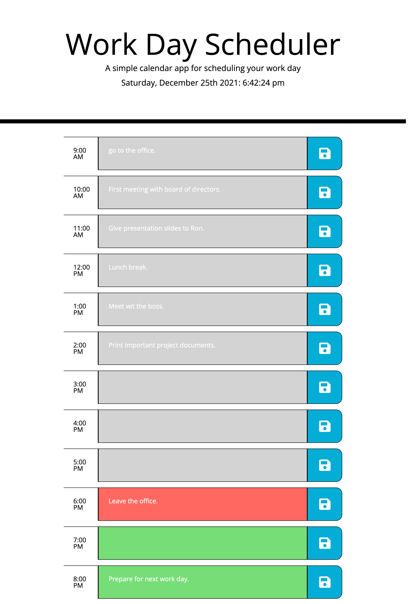
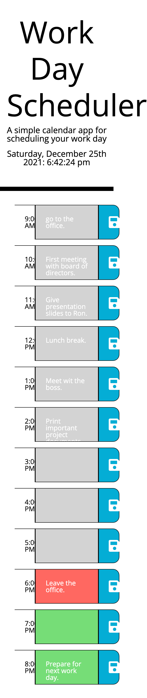

# plan-my-awesome-day-ohya

Link to deployment: https://sabrtraveler.github.io/plan-my-awesome-day-ohya/ 

This challenge of the bootcamp was to create a work day scheduler that alows a user to save events for each hour of the day.  
The work day scheduler has the following functionality: 

<li>At the top (under the header) it shows the current full date and time. 
<li>Presented with time blocks for standard business hours. 
<li>The time blocks are color graded to indicate whether it is in the past, present or future. 
<li>Great practice to learn css frameworks and javascript libraries. 
<li>Another challenge to strengthen our knowledge of saving data in local storage.  
The following images shows the web application's appearance and functionality:   
  
  
